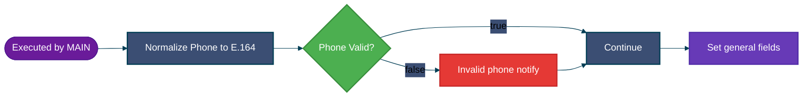
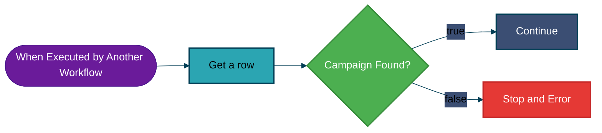
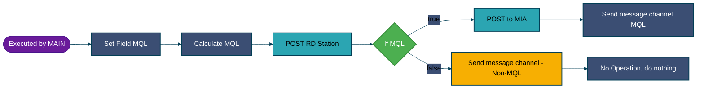
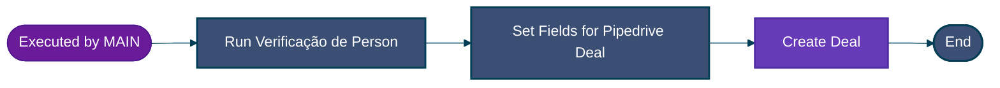
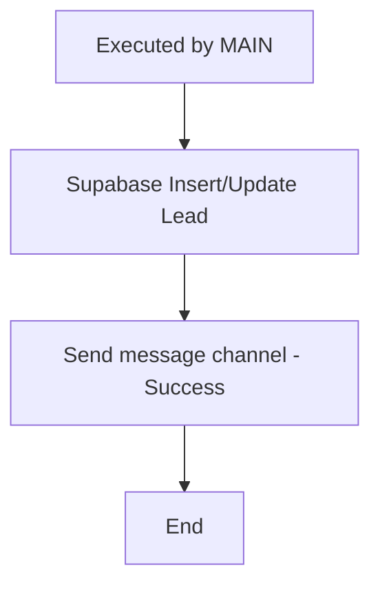

```mermaid
%%{init: {'theme':'base', 'themeVariables': { 'primaryColor':'#2ba5b2','primaryTextColor':'#000','primaryBorderColor':'#023e55','lineColor':'#023e55','secondaryColor':'#3b4e73','tertiaryColor':'#f7af02'}}}%%

graph LR
    Start([Executed by MAIN]) --> RDStation[POST RDStation Create Conversion]
    RDStation --> Hunter[GET Supabase Hunters by Region]
    Hunter --> Persona[SUB Verificação de Persona]
    Persona --> Pipedrive[CREATE Pipedrive Create Deal]
    Pipedrive --> Continue[Continue]

    style Start fill:#6a1b9a,stroke:#4a148c,color:#fff
    style RDStation fill:#2ba5b2,stroke:#023e55,stroke-width:2px,color:#000
    style Hunter fill:#3b4e73,stroke:#023e55,stroke-width:2px,color:#fff
    style Persona fill:#3b4e73,stroke:#023e55,stroke-width:2px,color:#fff
    style Pipedrive fill:#673AB7,stroke:#512DA8,stroke-width:2px,color:#fff
    style Continue fill:#3b4e73,stroke:#023e55,stroke-width:2px,color:#fff
```

<!-- title: 03 - Planejamento Técnico | url: https://outline.seazone.com.br/doc/03-planejamento-tecnico-htDkNBIYxI | area: Tecnologia -->

# 03 - Planejamento Técnico

# Arquitetura Técnica n8n: \[SZI\]\[Marketing\] Leads Ads

## Histórico de Revisões

| Revisão | Data | Elaborado por | Revisado por | Aprovado por |
|----|----|----|----|----|
| 00 | 22/10/2025 | [john.paiva@seazone.com.br](mailto:john.paiva@seazone.com.br) | \[Nome do Revisor\] | \[Nome do Aprovador\] |

## 📋 Sumário Executivo

Este documento descreve a arquitetura técnica completa para o fluxo de automação de leads do **SZI (Seazone Investimentos)** no n8n, projetada para substituir dezenas de cenários duplicados no [Make.com](http://Make.com) por uma **arquitetura unificada, parametrizável e escalável**.

### Objetivos da Migração

* **Eliminar duplicação**: Um único workflow parametrizável em vez de 40+ cenários similares
* **Melhorar governança**: Tratamento de erros robusto com notificações Slack estruturadas
* **Facilitar manutenção**: Configurações externalizadas no Supabase, alteráveis sem deploy
* **Escalar com qualidade**: Arquitetura preparada para crescimento de 100x no volume

### Contexto de Negócio

O SZI captura leads de **Facebook Lead Ads** para empreendimentos imobiliários, segmentando entre:

* **Investidores**: Interessados em comprar imóveis para investimento
* **Corretores/Parceiros**: Profissionais do mercado imobiliário

Os leads são qualificados (MQL baseado em regras de negócio), enviados para **RD Station**, direcionados para a **IA de vendas (MIA - apenas investidores MQL)** e **Pipedrive** conforme regras de negócio.


---

## 🏗️ Visão Geral da Arquitetura

### Princípios Arquiteturais


1. **Modularização**: Sub-workflows reutilizáveis para cada responsabilidade
2. **Parametrização por Campanha/Formulário**: Configurações no Supabase usando `form.id` como chave única
3. **Separação de Concerns**: Lógica, dados e integrações isoladas
4. **Idempotência**: Operações podem ser reexecutadas sem efeitos colaterais
5. **Resiliência**: Erros não bloqueiam fluxo crítico quando possível
6. **Centralização de Persistência**: Único sub-workflow para interação com Supabase

### Fluxo Macro

```mermaidjs
%%{init: {'theme':'base', 'themeVariables': { 'primaryColor':'#2ba5b2','primaryTextColor':'#000','primaryBorderColor':'#023e55','lineColor':'#023e55','secondaryColor':'#3b4e73','tertiaryColor':'#f7af02'}}}%%

graph LR
    Start([Facebook Lead Ads]) --> Validate[SUB: Validate & Normalize]
    Validate --> LoadConfig[SUB: Load Config]
    LoadConfig --> Switch{Switch: lead_segment}
    Switch -->|Investidor| Investor[SUB: Investor Journey]
    Switch -->|Corretor| Broker[SUB: Broker Journey]
    Broker --> Continue[Continue]
    Investor --> Continue
    Continue --> Supabase[SUB: Supabase Insert/Update]

    style Start fill:#2ba5b2,stroke:#023e55,color:#000
    style Validate fill:#3b4e73,stroke:#023e55,color:#fff
    style LoadConfig fill:#3b4e73,stroke:#023e55,color:#fff
    style Switch fill:#f7af02,stroke:#023e55,color:#000
    style Broker fill:#3b4e73,stroke:#023e55,color:#fff
    style Investor fill:#3b4e73,stroke:#023e55,color:#fff
    style Continue fill:#f7af02,stroke:#023e55,color:#000
    style Supabase fill:#3b4e73,stroke:#023e55,color:#fff
```


---

## 📦 1. Workflow Principal: \[MAIN\] Lead Ads Orchestrator

### Tags

* `szi`
* `marketing`

### Descrição

Workflow orquestrador que recebe leads do Facebook Lead Ads e coordena o processamento através de sub-workflows modulares.

### Diagrama Detalhado

```mermaidjs
%%{init: {'theme':'base', 'themeVariables': { 'primaryColor':'#2ba5b2','primaryTextColor':'#000','primaryBorderColor':'#023e55','lineColor':'#023e55','secondaryColor':'#3b4e73','tertiaryColor':'#f7af02'}}}%%

graph LR
    Start([Facebook Lead Ads Trigger]) --> Validate[Execute Workflow:<br/>Validate & Normalize]
    Validate --> LoadConfig[Execute Workflow:<br/>Load Config]
    LoadConfig --> Switch{Switch:<br/>lead_segment}
    Switch -->|Investidor| Investor[Execute Workflow:<br/>Investor Journey]
    Switch -->|Corretor| Broker[Execute Workflow:<br/>Broker Journey]
    Broker --> Continue[Continue]
    Investor --> Continue
    Continue --> Supabase[Execute Workflow:<br/>Supabase Insert/Update Lead]

    style Start fill:#2ba5b2,stroke:#023e55,color:#000
    style Validate fill:#3b4e73,stroke:#023e55,stroke-width:2px,color:#fff
    style LoadConfig fill:#3b4e73,stroke:#023e55,stroke-width:2px,color:#fff
    style Switch fill:#f7af02,stroke:#023e55,stroke-width:2px,color:#000
    style Broker fill:#3b4e73,stroke:#023e55,stroke-width:2px,color:#fff
    style Investor fill:#3b4e73,stroke:#023e55,stroke-width:2px,color:#fff
    style Continue fill:#f7af02,stroke:#023e55,stroke-width:2px,color:#000
    style Supabase fill:#3b4e73,stroke:#023e55,stroke-width:2px,color:#fff
```

### Nodes


1. **Facebook Lead Ads Trigger**
   * **Tipo**: `n8n-nodes-base.facebookLeadAdsTrigger`
   * **Descrição**: Recebe leads automaticamente do Facebook quando usuário preenche formulário
   * **Credenciais**: `[SZI] [Facebook Lead Ads] [OAuth2]`
   * **Configuração**:
     * Page: Seazone Investimentos (ID: 144663558738581)
     * Form: Configurado por campanha
2. **\[SUB\] Validate & Normalize**
   * **Tipo**: `n8n-nodes-base.executeWorkflow`
   * **Sub-workflow**: `[SUB] Validate & Normalize`
   * **Entrada**: Lead data do webhook
   * **Saída**: Lead normalizado com `lead_segment`, `phone` E.164, campos mapeados
3. **\[SUB\] Load Config**
   * **Tipo**: `n8n-nodes-base.executeWorkflow`
   * **Sub-workflow**: `[SUB] Load Config`
   * **Entrada**: `form.id` do webhook
   * **Saída**: Configurações da campanha (empreendimento, MIA, Pipedrive, hunters)
4. **Switch: lead_segment**
   * **Tipo**: `n8n-nodes-base.switch`
   * **Condição**: `{{ $('[SUB] Validate & Normalize').item.json.lead_segment }}`
   * **Mode**: Rules
   * **True Branch**: Broker Journey (Corretor)
   * **False Branch**: Investor Journey (Investidor)
5. **\[SUB\] Investor Journey**
   * **Tipo**: `n8n-nodes-base.executeWorkflow`
   * **Sub-workflow**: `[SUB] Investor Journey`
   * **Entrada**: Lead normalizado + config
   * **Saída**: Variáveis `is_mql`, `rd_sent`, `mia_sent`, `pipedrive_deal_id`, `pipedrive_person_id`
6. **\[SUB\] Broker Journey**
   * **Tipo**: `n8n-nodes-base.executeWorkflow`
   * **Sub-workflow**: `[SUB] Broker Journey`
   * **Entrada**: Lead normalizado + config
   * **Saída**: Variáveis `rd_sent`, `pipedrive_deal_id`, `pipedrive_person_id`, `hunter_owner_id`
7. **Continue**
   * **Tipo**: `n8n-nodes-base.merge`
   * **Descrição**: Unifica outputs dos dois caminhos (broker ou investor) antes de salvar no Supabase
8. **\[SUB\] Supabase Insert/Update Lead**
   * **Tipo**: `n8n-nodes-base.executeWorkflow`
   * **Sub-workflow**: `[SUB] Supabase Insert/Update Lead`
   * **Descrição**: Centraliza toda interação com Supabase - UPSERT na tabela `leads`
   * **Retry**: 3x, 5s wait, 30s timeout

### Parâmetros de Entrada (payload do webhook do Facebook Lead Ads)

```json
[
  {
    "id": "3782175868746312",
    "data": {
      "Empreendimento": "Canas Beach Spot",
      "você_é_corretor_de_imóveis?": "sim",
      "você_procura_investimento_ou_para_uso_próprio?": "Uso próprio - moradia",
      "qual_o_valor_total_que_você_pretende_investir_dentro_de_54_meses?": "R$ 50.000 a R$ 100.000 em até 54 meses",
      "qual_a_forma_de_pagamento?": "À vista via PIX ou boleto",
      "região_de_atuação": "sudeste",
      "full_name": "teste n8n",
      "email": "teste@seazone.com.br",
      "phone_number": "+5577985678877"
    },
    "form": {
      "id": "1984062249106864",
      "name": "[TESTE] - [Formulário] [SZI] Canas Beach Spot | 14/10/2025",
      "locale": "pt_BR",
      "status": "ACTIVE"
    },
    "ad": {},
    "adset": {},
    "page": {
      "name": "Seazone Investimentos",
      "id": "144663558738581"
    },
    "created_time": "2025-10-14T18:50:16+0000"
  }
]
```


---


## ✅ 2. Sub-workflow: Validar e Normalizar

### Nome

`[SUB] Validate & Normalize`

### Tags

* `szi`
* `marketing`

### Objetivo

Validar e normalizar telefone para formato E.164, mapear campos do formulário para estrutura padrão, determinar lead_segment.

### Diagrama



### Mapeamento de Campos

| Campo Original | Destino | Normalização |
|----|----|----|
| `data.Empreendimento` | `enterprise_name` | String direta |
| `data["você_é_corretor_de_imóveis?"]` | `lead_segment` | "sim" → "corretor", "não" → "investidor" |
| `data["você_procura_investimento_ou_para_uso_próprio?"]` | `lead_intencao` | String direta |
| `data["qual_o_valor_total_que_você_pretende_investir_dentro_de_54_meses?"]` | `lead_investimento` | String direta |
| `data["qual_a_forma_de_pagamento?"]` | `lead_forma_pagamento` | String direta |
| `data["região_de_atuação"]` | `lead_region` | `.toLowerCase()` |
| `data.full_name` | `lead_full_name` | String direta |
| `data.email` | `lead_email` | String direta |
| `data.phone_number` | `lead_phone_raw` | String direta |
| `data.phone_number` | `lead_phone_normalized` | Normalizado para E.164 |
| `form.id` | `form_id` | String direta |
| `form.name` | `form_name` | String direta |
| `form.status` | `form_status` | String direta |
| `page.name` | `page_name` | String direta |
| `page.id` | `page_id` | String direta |
| `form.id + "_" + form.name` | `utm_criativo` | Concatenado com espaços substituídos por "_" |

### Normalização de Telefone para E.164

O formato **E.164** é o padrão internacional para números de telefone, essencial para integração com APIs de telefonia e WhatsApp.

#### Formato E.164

```
+[código_país][DDD][número]
```

#### Exemplos de Normalização

| Input Original | Output E.164 | Observação |
|----|----|----|
| `(11) 98765-4321` | `+5511987654321` | São Paulo - celular |
| `11987654321` | `+5511987654321` | Sem formatação |
| `+55 11 98765-4321` | `+5511987654321` | Já com +55 |
| `5511987654321` | `+5511987654321` | Sem + inicial |
| `(85) 3456-7890` | `+558534567890` | Ceará - fixo |
| `(00) 91234-5678` | `INVÁLIDO` | DDD inexistente |

#### Validação de DDD (Brasil)

DDDs válidos: 11-99 (exceto 20, 23, 25-29, 30, 36, 39, 40, 50, 52-60, 70, 72, 73, 76, 80, 90)

Se DDD inválido: marcar `phone_invalid = true`, notificar Slack, mas **continuar o fluxo**.

### Estrutura de Saída Completa

```json
[
  {
    "lead_ads_id": "1187211379934213",
    "enterprise_name": "Canas Beach Spot",
    "lead_segment": "corretor",
    "lead_intencao": "Investimento - valorização do imóvel",
    "lead_investimento": "R$ 300.001 a R$ 400.000 em até 54 meses",
    "lead_forma_pagamento": "Parcelado via PIX ou boleto",
    "lead_region": "centro-oeste",
    "lead_full_name": "Teste",
    "lead_email": "johnpaulo0602@gmail.com",
    "lead_phone_normalized": "+5561996973287",
    "lead_phone_raw": "+5561996973287",
    "form_id": "1984062249106864",
    "form_name": "[TESTE] - [Formulário] [SZI] Canas Beach Spot | 14/10/2025",
    "form_status": "ACTIVE",
    "page_name": "Seazone Investimentos",
    "page_id": "144663558738581",
    "utm_criativo": "1984062249106864_[TESTE]_-_[Formulário]_[SZI]_Canas_Beach_Spot_|_14/10/2025"
  }
]
```

### Nodes


1. **Executed by MAIN**
   * **Tipo**: `n8n-nodes-base.executeWorkflowTrigger`
   * **Descrição**: Ponto de entrada do sub-workflow, acionado pelo workflow principal
   * **Entrada**: Dados do lead do Facebook Lead Ads
   * **Saída**: Dados brutos do lead para processamento
2. **Normalize Phone to E.164**
   * **Tipo**: `n8n-nodes-base.code`
   * **Descrição**: Node de código que normaliza telefone brasileiro para formato E.164
   * **Funcionalidades**:
     * Extrai apenas dígitos do input
     * Valida DDD brasileiro (11-99, exceto DDDs inexistentes)
     * Valida formato celular (9 dígitos após DDD) ou fixo (8 dígitos após DDD)
     * Retorna telefone normalizado ou marca como inválido
   * **Saída**: `phone_normalized`, `phone_invalid`, `phone_invalid_reason`, `phone_raw`
3. **Phone Valid?**
   * **Tipo**: `n8n-nodes-base.if`
   * **Condição**: `{{ $json.phone_invalid }} === false`
   * **True Branch**: Telefone válido → Continue
   * **False Branch**: Telefone inválido → Invalid phone notify
4. **Invalid phone notify**
   * **Tipo**: `n8n-nodes-base.slack`
   * **Descrição**: Envia notificação para canal Slack quando telefone é inválido
   * **Canal**: `teste-automacao`
   * **Conteúdo**: Nome do lead, telefone bruto e motivo da invalidação
   * **Após notificação**: Continua para o node Continue
5. **Continue**
   * **Tipo**: `n8n-nodes-base.noOp`
   * **Descrição**: Ponto de junção para fluxos de telefone válido e inválido
   * **Função**: Garantir que ambos os caminhos se unam antes de prosseguir
6. **Set general fields**
   * **Tipo**: `n8n-nodes-base.set`
   * **Descrição**: Mapeia e define todos os campos normalizados do lead
   * **Funcionalidades**:
     * Mapeia campos do formulário para estrutura padrão
     * Determina `lead_segment` baseado na resposta "você_é_corretor_de_imóveis?"
     * Gera `utm_criativo` concatenando [form.id](http://form.id) e [form.name](http://form.name) (TO DO deve concatenar o campanha_id e campanha_name, ainda não foi feito pois precisa de permissao no app do facebook ads.)
     * Normaliza `lead_region` para lowercase
   * **Saída**: Objeto JSON com todos os campos do lead normalizados


\
## 🔧 3. Sub-workflow: Carregar Configurações

### Nome

`[SUB] Load Config`

### Tags

* `szi`
* `marketing`

### Objetivo

Buscar configurações da campanha no Supabase usando o `form_id` como chave única. Cada formulário do Facebook Lead Ads corresponde a uma campanha cadastrada na tabela `campanhas` no supabase.

### Diagrama



### Entrada

```json
{
  "form_id": "1984062249106864"
}
```

### Saída

```json
[
  {
    "id": "12850b25-ae70-477c-ba74-0863893a7aaf",
    "form_id": "1984062249106864",
    "form_name": "[TESTE] - [Formulário] [SZI] Canas Beach Spot | 14/10/2025",
    "campanha_id": "120246218009620555",
    "campanha_name": "[SI] [LEAD ADS] [RS/SC/PR] [CBO] Canas beach Spot | 06/10/2025",
    "rd_traffic_medium": "cpc",
    "rd_traffic_campaign": "[SI] [LEAD ADS] [RS/SC/PR] [CBO] Canas beach Spot | 06/10/2025",
    "rd_traffic_source": "Facebook Ads",
    "slack_channel_error": "teste-automacao",
    "slack_channel_notification": "teste-automacao",
    "mql_investimento_renda": true,
    "mql_investimento_valorizacao": true,
    "mql_uso_proprio_moradia": false,
    "mql_uso_proprio_esporadico": false,
    "mql_faixa_50k_100k": false,
    "mql_faixa_100k_200k": false,
    "mql_faixa_200k_300k": true,
    "mql_faixa_300k_400k": true,
    "mql_faixa_400k_plus": true,
    "mql_faixa_sem_condicao": false,
    "mql_forma_avista": true,
    "mql_forma_parcelado": true,
    "mql_forma_sem_condicao": false,
    "mia_product_id": "ba7630e5-ada0-4ada-af51-c10e2d9baecf",
    "mia_instance_id": "1292",
    "mia_source": "Busca Paga | Facebook Ads",
    "mia_message_template": "szi_canasbeach_1709",
    "pipedrive_stage_id_investor": "396",
    "pipedrive_stage_id_broker": "396",
    "created_at": "2025-10-23T04:25:19.392487+00:00",
    "updated_at": "2025-10-23T04:25:19.392487+00:00"
  }
]
```

### Nodes


1. **When Executed by Another Workflow**
   * **Tipo**: `n8n-nodes-base.executeWorkflowTrigger`
   * **Descrição**: Ponto de entrada do sub-workflow, acionado pelo workflow principal
   * **Entrada**: `form_id` do lead normalizado
   * **Saída**: `form_id` para consulta no Supabase
2. **Get a row**
   * **Tipo**: `n8n-nodes-base.supabase`
   * **Operação**: `get` (SELECT)
   * **Tabela**: `campanhas`
   * **Filtro**: `form_id = {{ $json.form_id }}`
   * **Retry**: 3x, 5s wait, 30s timeout
   * **Credenciais**: `[SZI] [Supabase] [API Key]`
   * **Descrição**: Busca a configuração da campanha no Supabase usando o form_id como chave única
3. **Campaign Found?**
   * **Tipo**: `n8n-nodes-base.if`
   * **Condição**: `{{ $json["id"] !== undefined && $json["id"] !== null }}`
   * **True Branch**: Campanha encontrada → Continue
   * **False Branch**: Campanha não encontrada → Stop and Error
4. **Continue**
   * **Tipo**: `n8n-nodes-base.noOp`
   * **Descrição**: Ponto de continuação quando campanha é encontrada
   * **Saída**: Dados completos da campanha para os próximos sub-workflows
5. **Stop and Error**
   * **Tipo**: `n8n-nodes-base.stopAndError`
   * **Descrição**: Para o workflow com erro quando campanha não é encontrada
   * **Mensagem**: "Campanha não cadastrada para o [form.id](http://form.id) informado"
   * **Comportamento**: Termina o workflow principal com erro


---

## 🤝 4. Sub-workflow: Jornada do Corretor

### Nome

`[SUB] Broker Journey`

### Tags

* `szi`
* `marketing`
* `rdstation`
* `pipedrive`

### Objetivo

Processar leads de corretores/parceiros:


1. Enviar para RD Station
2. Buscar hunter por região
3. Enviar para Pipedrive

### Diagrama



### Entrada

```json
{
  "enterprise_name": "Canas Beach Spot",
  "lead_ads_id": "1187211379934213",
  "lead_email": "teste@seazone.com.br",
  "lead_region": "centro-oeste",
  "lead_full_name": "Teste",
  "lead_is_broker": "Sim",
  "lead_segment": "corretor",
  "lead_phone_normalized": "+5561996973287",
  "form_id": "1984062249106864",
  "form_name": "[TESTE] - [Formulário] [SZI] Canas Beach Spot | 14/10/2025",
  "page_name": "Seazone Investimentos",
  "page_id": "144663558738581",
  "utm_criativo": "1984062249106864_[TESTE]_-_[Formulário]_[SZI]_Canas_Beach_Spot_|_14/10/2025",
  "campanha_id": "120246218009620555",
  "campanha_name": "[SI] [LEAD ADS] [RS/SC/PR] [CBO] Canas beach Spot | 06/10/2025",
  "rd_traffic_medium": "cpc",
  "rd_traffic_campaign": "[SI] [LEAD ADS] [RS/SC/PR] [CBO] Canas beach Spot | 06/10/2025",
  "rd_traffic_source": "Facebook Ads",
  "rd_observation": "O contato passou esses dados brutos como possíveis telefones para contato: +5561996973287",
  "slack_channel_error": "teste-automacao",
  "slack_channel_notification": "teste-automacao",
  "pipedrive_stage_id_broker": "396",
  "rd_event": "SZS_lead_ads_canas_beach_spot"
}
```

### Saída

```json
{
  "rd_sent": true,
  "pipedrive_deal_id": "12345",
  "pipedrive_person_id": "67890",
  "hunter_owner_id": "hunter_123"
}
```

### Nodes


1. **Executed by MAIN**
   * **Tipo**: `n8n-nodes-base.executeWorkflowTrigger`
   * **Descrição**: Ponto de entrada do sub-workflow, acionado pelo workflow principal
2. **\[POST\] \[RDStation\] \[Create Conversion\]**
   * **Tipo**: `n8n-nodes-base.httpRequest`
   * **Descrição**: Envia conversão para RD Station com dados do lead e campos customizados
   * **Campos Enviados**:

   ```json
   {
     "event_type": "CONVERSION",
     "event_family": "CDP",
     "payload": {
       "conversion_identifier": "{{ rd_event }}",
       "email": "{{ lead_email }}",
       "name": "{{ lead_full_name }}",
       "mobile_phone": "{{ lead_phone_normalized }}",
       "personal_phone": "{{ lead_phone_normalized }}",
       "traffic_source": "{{ rd_traffic_source }}",
       "traffic_medium": "{{ rd_traffic_medium }}",
       "traffic_campaign": "{{ campanha_name }}",
       "cf_voce_e_corretor_de_imoveis": "{{ lead_is_broker }}",
       "cf_utm_criativo": "{{ utm_criativo }}",
       "cf_empreendimento": "{{ enterprise_name }}",
       "cf_interno_observacao_pipedrive": "{{ rd_observation }}",
       "cf_empreendimento_0": "{{ enterprise_name }}",
       "cf_lead_id_lead_ads": "{{ lead_ads_id }}"
     }
   }
   ```
3. **\[GET\] \[Supabase\] \[Hunters by Region\]**
   * **Tipo**: `n8n-nodes-base.supabase`
   * **Descrição**: Busca hunter responsável pela região do lead
   * **Filtros**:

   ```json
   {
     "regiao": "{{ lead_region }}"
   }
   ```
4. **\[SUB\] Verificação de Persona**
   * **Tipo**: `n8n-nodes-base.executeWorkflow`
   * **Descrição**: Verifica se pessoa já existe no Pipedrive ou cria nova
   * **Campos Enviados**:

   ```json
   {
     "name": "{{ lead_full_name }}",
     "phone": "{{ lead_phone_normalized }}",
     "email": "{{ lead_email }}"
   }
   ```
5. **\[CREATE\] \[Pipedrive\] \[Create Deal\]**
   * **Tipo**: `n8n-nodes-base.pipedrive`
   * **Descrição**: Cria deal no Pipedrive para o corretor
   * **Campos Enviados**:

   ```json
   {
     "title": "{{ lead_full_name.toUpperCase() }}",
     "associateWith": "person",
     "person_id": "{{ persona.person_id }}",
     "stage_id": 396,
     "status": "open",
     "user_id": "{{ hunter.owner_id }}",
     "customProperties": {
       "6d565fd4fce66c16da078f520a685fa2fa038272": "{{ enterprise_name }}",
       "1f91c7451cf87c5f7e69b4af88e04ee0b3655358": "{{ rd_observation }}",
       "837653ab193c6a293b346fb464a8a89c6259bc0b": "{{ rdstation.event_uuid }}",
       "e446c37fb126d0a122ae3a1d2f6a5b5716038731": "{{ utm_criativo }}",
       "0083d30d9321aec4213ffa6302b32fd1dca9ee6a": "{{ campanha_id }}",
       "ff53f6910138fa1d8969b686acb4b1336d50c9bd": "{{ rd_traffic_source }}",
       "93b3ada8b94bd1fc4898a25754d6bcac2713f835": "12"
     }
   }
   ```
6. **Continue**
   * **Tipo**: `n8n-nodes-base.noOp`
   * **Descrição**: Ponto de continuação após processamento completo


\
## 💰 5. Sub-workflow: Jornada do Investidor

### Nome

`[SUB] Investor Journey`

### Tags

* `szi`
* `marketing`
* `rdstation`
* `mia`

### Objetivo

Processar leads de investidores:


1. Avaliar regras MQL
2. Enviar para RD Station
3. Se **MQL** → enviar para MIA + notificar Slack MQL
4. Se **Non-MQL** → apenas notificar Slack Non-MQL

### Diagrama



### Lógica de Qualificação MQL (Simplificada)

**Sistema simples**: Uma coluna para cada resposta possível. Marketing define true ou false diretamente no Supabase.

#### Configuração MQL na Tabela `campanhas` no Supabase

| Coluna | Tipo | Descrição |
|----|----|----|
| **Intenção** |    |    |
| `mql_investimento_renda` | boolean | ✅ = MQL se resposta for "Investimento - renda com aluguel" |
| `mql_investimento_valorizacao` | boolean | ✅ = MQL se resposta for "Investimento - valorização" |
| `mql_uso_proprio_moradia` | boolean | ✅ = MQL se resposta for "Uso próprio - moradia" |
| `mql_uso_proprio_esporadico` | boolean | ✅ = MQL se resposta for "Uso próprio - esporádico" |
| **Faixa Investimento** |    |    |
| `mql_faixa_50k_100k` | boolean | ✅ = MQL se R$ 50k-100k |
| `mql_faixa_100k_200k` | boolean | ✅ = MQL se R$ 100k-200k |
| `mql_faixa_200k_300k` | boolean | ✅ = MQL se R$ 200k-300k |
| `mql_faixa_300k_400k` | boolean | ✅ = MQL se R$ 300k-400k |
| `mql_faixa_400k_plus` | boolean | ✅ = MQL se acima de R$ 400k |
| `mql_faixa_sem_condicao` | boolean | ✅ = MQL se "Não consigo atender condições" |
| **Forma Pagamento** |    |    |
| `mql_forma_avista` | boolean | ✅ = MQL se "À vista" |
| `mql_forma_parcelado` | boolean | ✅ = MQL se "Parcelado" |
| `mql_forma_sem_condicao` | boolean | ✅ = MQL se "Não tenho condição" |

#### Como Funciona

Lead é **MQL** se **TODAS** as 3 verificações passarem:


1. ✅ Coluna da intenção = `true`
2. ✅ Coluna da faixa = `true`
3. ✅ Coluna da forma pagamento = `true`

#### Exemplo Prático

| Coluna | Valor |
|----|----|
| `mql_investimento_renda` | ✅ `true` |
| `mql_investimento_valorizacao` | ✅ `true` |
| `mql_uso_proprio_moradia` | ❌ `false` |
| `mql_uso_proprio_esporadico` | ❌ `false` |
| `mql_faixa_200k_300k` | ✅ `true` |
| `mql_faixa_300k_400k` | ✅ `true` |
| `mql_faixa_400k_plus` | ✅ `true` |
| `mql_forma_avista` | ✅ `true` |
| `mql_forma_parcelado` | ✅ `true` |

##### Exemplo MQL

**Lead chega:**

* Intenção original: `"Investimento - renda com aluguel"`
* Intenção MQL: `"investimento_renda"` (campo `intencao_mql`)
* Faixa original: `"R$ 300.001 a R$ 400.000 em até 54 meses"`
* Faixa MQL: `"300k-400k"` (campo `faixa_investimento_mql`)
* Forma original: `"À vista via PIX ou boleto"`
* Forma MQL: `"avista"` (campo `forma_pagamento_mql`)

**Avaliação:**


1. Verifica `mql_investimento_renda` → ✅ `true`
2. Verifica `mql_faixa_300k_400k` → ✅ `true`
3. Verifica `mql_forma_avista` → ✅ `true`

**Resultado**: ✅ **É MQL**

##### Exemplo Non-MQL

**Lead chega:**

* Intenção original: `"Uso próprio - moradia"`
* Intenção MQL: `"uso_proprio_moradia"` (campo `intencao_mql`)
* Faixa original: `"R$ 50.000 a R$ 100.000 em até 54 meses"`
* Faixa MQL: `"50k-100k"` (campo `faixa_investimento_mql`)
* Forma original: `"Parcelado via PIX ou boleto"`
* Forma MQL: `"parcelado"` (campo `forma_pagamento_mql`)

**Avaliação:**


1. Verifica `mql_uso_proprio_moradia` → ❌ `false`
2. Verifica `mql_faixa_50k_100k` → ❌ `false`
3. Verifica `mql_forma_parcelado` → ❌ `false`

**Resultado**: ❌ **Não é MQL**

### Entrada

```json
{
  "enterprise_name": "Canas Beach Spot",
  "lead_ads_id": "1187211379934213",
  "lead_is_broker": "Não",
  "lead_intencao": "Investimento - valorização do imóvel",
  "lead_investimento": "R$ 300.001 a R$ 400.000 em até 54 meses",
  "lead_forma_pagamento": "Parcelado via PIX ou boleto",
  "lead_region": "centro-oeste",
  "lead_full_name": "Teste",
  "lead_email": "testes@seazone.com.br",
  "lead_phone_normalized": "+5561996973287",
  "lead_phone_raw": "+5561996973287",
  "form_id": "1984062249106864",
  "form_name": "[TESTE] - [Formulário] [SZI] Canas Beach Spot | 14/10/2025",
  "page_name": "Seazone Investimentos",
  "page_id": "144663558738581",
  "utm_criativo": "1984062249106864_[TESTE]_-_[Formulário]_[SZI]_Canas_Beach_Spot_|_14/10/2025",
  "campanha_id": "120246218009620555",
  "campanha_name": "[SI] [LEAD ADS] [RS/SC/PR] [CBO] Canas beach Spot | 06/10/2025",
  "rd_traffic_medium": "cpc",
  "rd_traffic_campaign": "[SI] [LEAD ADS] [RS/SC/PR] [CBO] Canas beach Spot | 06/10/2025",
  "rd_traffic_source": "Facebook Ads",
  "rd_event": "SZI_lead_ads_canas_beach_spot",
  "rd_observation": "O contato passou esses dados brutos como possíveis telefones para contato: +5561996973287",
  "slack_channel_error": "teste-automacao",
  "slack_channel_notification": "teste-automacao",
  "mql_investimento_renda": false,
  "mql_investimento_valorizacao": false,
  "mql_uso_proprio_moradia": false,
  "mql_uso_proprio_esporadico": false,
  "mql_faixa_50k_100k": false,
  "mql_faixa_100k_200k": false,
  "mql_faixa_200k_300k": true,
  "mql_faixa_300k_400k": true,
  "mql_faixa_400k_plus": true,
  "mql_faixa_sem_condicao": false,
  "mql_forma_avista": true,
  "mql_forma_parcelado": true,
  "mql_forma_sem_condicao": false,
  "mia_product_id": "ba7630e5-ada0-4ada-af51-c10e2d9baecf",
  "mia_instance_id": "1292",
  "mia_source": "Busca Paga | Facebook Ads",
  "mia_message_template": "szi_canasbeach_1709",
  "pipedrive_stage_id_investor": "396",
  "pipedrive_stage_id_broker": "396"
}
```

### Saída

```json
{
  "is_mql": true,
  "rd_sent": true,
  "mia_sent": true,
  "pipedrive_deal_id": null,
  "pipedrive_person_id": null
}
```

### Nodes


1. **Executed by MAIN**
   * **Tipo**: `n8n-nodes-base.executeWorkflowTrigger`
   * **Descrição**: Ponto de entrada do sub-workflow, acionado pelo workflow principal
2. **Set Field MQL**
   * **Tipo**: `n8n-nodes-base.code`
   * **Descrição**: Normaliza e mapeia campos do lead para formato MQL
   * **Campos Processados**:

   ```json
   {
     "mql_data": {
       "intencao_mql": "{{ lead_intencao }} → investimento_valorizacao",
       "faixa_investimento_mql": "{{ lead_investimento }} → 300k-400k",
       "forma_pagamento_mql": "{{ lead_forma_pagamento }} → parcelado"
     }
   }
   ```
3. **Calculate MQL**
   * **Tipo**: `n8n-nodes-base.code`
   * **Descrição**: Aplica regras MQL para determinar se lead é qualificado
   * **Lógica**: Verifica se TODAS as 3 condições são verdadeiras:
     * Intenção: `mql_investimento_valorizacao = true`
     * Faixa: `mql_faixa_300k_400k = true`
     * Forma: `mql_forma_parcelado = true`
   * **Saída**: `{ "is_mql": true/false }`
4. **POST RD Station**
   * **Tipo**: `n8n-nodes-base.httpRequest`
   * **Descrição**: Envia conversão para RD Station com dados do lead
   * **Campos Enviados**:

   ```json
   {
     "event_type": "CONVERSION",
     "event_family": "CDP",
     "payload": {
       "conversion_identifier": "{{ rd_event }}",
       "email": "{{ lead_email }}",
       "name": "{{ lead_full_name }}",
       "mobile_phone": "{{ lead_phone_normalized }}",
       "personal_phone": "{{ lead_phone_normalized }}",
       "traffic_source": "{{ rd_traffic_source }}",
       "traffic_medium": "{{ rd_traffic_medium }}",
       "traffic_campaign": "{{ campanha_name }}",
       "cf_voce_procura_investimento_ou_moradia": "{{ lead_intencao }}",
       "cf_como_voce_gostaria_de_fazer_o_pagamento": "{{ lead_forma_pagamento }}",
       "cf_voce_e_corretor_de_imoveis": "{{ lead_is_broker }}",
       "cf_utm_criativo": "{{ utm_criativo }}",
       "cf_empreendimento": "{{ enterprise_name }}",
       "cf_interno_observacao_pipedrive": "{{ rd_observation }}",
       "cf_empreendimento_0": "{{ enterprise_name }}",
       "cf_lead_id_lead_ads": "{{ lead_ads_id }}",
       "cf_qual_o_valor_que_voce_pretende_investir": "{{ lead_investimento }}"
     }
   }
   ```
5. **If MQL**
   * **Tipo**: `n8n-nodes-base.if`
   * **Condição**: `{{ $node["Calculate MQL"].json["is_mql"] }} === true`
   * **True Branch**: Lead é MQL → POST to MIA
   * **False Branch**: Lead não é MQL → Send message channel - Non-MQL
6. **POST to MIA**
   * **Tipo**: `n8n-nodes-base.httpRequest`
   * **Descrição**: Envia lead qualificado para IA de vendas (MIA)
   * **Campos Enviados**:

   ```json
   {
     "name": "{{ lead_full_name }}",
     "email": "{{ lead_email }}",
     "phoneNumber": "{{ lead_phone_normalized }}",
     "productId": "{{ mia_product_id }}",
     "instanceId": "{{ mia_instance_id }}",
     "source": "{{ mia_source }}",
     "extras": {
       "campaign": "{{ campanha_name }}",
       "medium": "{{ rd_event }}"
     },
     "messageTemplate": "{{ mia_message_template }}",
     "specialInstructions": "Perguntas qualificadoras já preenchidas pelo lead: 1- Você procura investimento ou para uso próprio? R: {{ lead_intencao }}; 2- Qual o valor total que você pretende investir? {{ lead_investimento }}; 4- Qual a forma de pagamento? R: {{ lead_forma_pagamento }}"
   }
   ```
7. **Send message channel MQL**
   * **Tipo**: `n8n-nodes-base.slack`
   * **Descrição**: Notifica canal Slack sobre lead MQL qualificado
   * **Canal**: `teste-automacao`
   * **Conteúdo**: Lead MQL com dados completos e status de qualificação
8. **Send message channel - Non-MQL**
   * **Tipo**: `n8n-nodes-base.slack`
   * **Descrição**: Notifica canal Slack sobre lead não qualificado
   * **Canal**: `teste-automacao`
   * **Conteúdo**: Lead Non-MQL com dados completos
9. **No Operation, do nothing**
   * **Tipo**: `n8n-nodes-base.noOp`
   * **Descrição**: Ponto de continuação para leads não qualificados


---

## 📤 6. Sub-workflow: Criar deal no pipedrive

### Nome

`[SUB] Create Deal Pipedrive`

### Tags

* `szi`
* `marketing`
* `pipedrive`

### Objetivo

Criar deal no Pipedrive para leads processados:


1. Verificar/criar persona no Pipedrive
2. Preparar campos do deal
3. Criar deal com campos customizados

### Diagrama



### Entrada

```json
{
  "lead_name": "Teste da Silva Teste",
  "lead_email": "teste@teste.com.br",
  "lead_phone": "+55998767655"
}
```

### Saída

```json
{
  "deal_id": "12345",
  "person_id": "67890"
}
```

### Nodes


1. **Executed by MAIN**
   * **Tipo**: `n8n-nodes-base.executeWorkflowTrigger`
   * **Descrição**: Ponto de entrada do sub-workflow, acionado pelo workflow principal
2. **Run Verificação de Person**
   * **Tipo**: `n8n-nodes-base.executeWorkflow`
   * **Descrição**: Sub-fluxo de Person - Procura o lead na base de persons pelo email passado
   * **Funcionalidade**:
     * Se não existe: cria um novo person e retorna o id novo
     * Se já existe: atualiza os campos de contato e responde o último id gerado no Pipedrive
   * **Campos Enviados**:

   ```json
   {
     "name": "{{ lead_name }}",
     "email": "{{ lead_email }}",
     "phone": "{{ lead_phone }}"
   }
   ```
3. **Set Fields for Pipedrive Deal**
   * **Tipo**: `n8n-nodes-base.set`
   * **Descrição**: Prepara todos os campos necessários para criação do deal
   * **Campos Configurados**:

   ```json
   {
     "tittle_deal": "{{ lead_name.toUpperCase() }}",
     "corretor": "",
     "empreendimento": "",
     "lead_ads_id": "",
     "observacao": "",
     "evento": "",
     "regiao": "",
     "owner_id": "",
     "utm_criativo": "",
     "id_conversao": "",
     "rd_source": ""
   }
   ```
4. **Create Deal**
   * **Tipo**: `n8n-nodes-base.pipedrive`
   * **Descrição**: Cria deal no Pipedrive com persona associada
   * **Campos Enviados**:

   ```json
   {
     "title": "{{ tittle_deal }}",
     "associateWith": "person",
     "person_id": "{{ persona.person_id }}",
     "stage_id": 396,
     "status": "open",
     "user_id": "{{ owner_id }}",
     "customProperties": {
       "6d565fd4fce66c16da078f520a685fa2fa038272": "{{ empreendimento }}",
       "1f91c7451cf87c5f7e69b4af88e04ee0b3655358": "{{ observacao }}",
       "837653ab193c6a293b346fb464a8a89c6259bc0b": "{{ evento }}",
       "e446c37fb126d0a122ae3a1d2f6a5b5716038731": "{{ utm_criativo }}",
       "0083d30d9321aec4213ffa6302b32fd1dca9ee6a": "{{ id_conversao }}",
       "ff53f6910138fa1d8969b686acb4b1336d50c9bd": "{{ rd_source }}",
       "93b3ada8b94bd1fc4898a25754d6bcac2713f835": "12"
     }
   }
   ```
5. **End**
   * **Tipo**: `n8n-nodes-base.noOp`
   * **Descrição**: Ponto de finalização do sub-workflow


---

## 📤 7. Sub-workflow: Supabase Insert/Update

Este sub-workflow é responsável por inserir ou atualizar o lead no banco de dados Supabase e enviar notificação no Slack.

### Fluxo do Sub-workflow



### Entrada

```json
{
  "lead_ads_id": "1187211379934213",
  "execution_id": "exec_abc123",
  "enterprise_name": "Canas Beach Spot",
  "lead_segment": "investidor",
  "lead_intencao": "Investimento - valorização do imóvel",
  "lead_investimento": "R$ 300.001 a R$ 400.000 em até 54 meses",
  "lead_forma_pagamento": "Parcelado via PIX ou boleto",
  "lead_region": "centro-oeste",
  "lead_full_name": "João Silva",
  "lead_email": "joao@email.com",
  "lead_phone_normalized": "+5561996973287",
  "lead_phone_raw": "+5561996973287",
  "lead_is_broker": "Não",
  "form_id": "1984062249106864",
  "form_name": "[TESTE] - [Formulário] [SZI] Canas Beach Spot | 14/10/2025",
  "form_status": "ACTIVE",
  "page_name": "Seazone Investimentos",
  "page_id": "144663558738581",
  "utm_criativo": "1984062249106864_[TESTE]_-_[Formulário]_[SZI]_Canas_Beach_Spot_|_14/10/2025",
  "campanha_id": "120246218009620555",
  "campanha_name": "[SI] [LEAD ADS] [RS/SC/PR] [CBO] Canas beach Spot | 06/10/2025",
  "rd_traffic_medium": "cpc",
  "rd_traffic_campaign": "[SI] [LEAD ADS] [RS/SC/PR] [CBO] Canas beach Spot | 06/10/2025",
  "rd_traffic_source": "Facebook Ads",
  "rd_event": "SZI_lead_ads_canas_beach_spot",
  "rd_observation": "O contato passou esses dados brutos como possíveis telefones para contato: +5561996973287",
  "is_mql": true,
  "rd_sent": true,
  "mia_sent": true,
  "pipedrive_deal_id": "12345",
  "pipedrive_person_id": "67890",
  "hunter_owner_id": "hunter_123",
  "slack_channel_error": "teste-automacao",
  "slack_channel_notification": "teste-automacao"
}
```

### Saída

```json
{
  "success": true,
  "lead_id": "uuid-do-lead-criado",
  "message": "Lead inserido/atualizado com sucesso no Supabase"
}
```

### Descrição dos Nodes

#### 1. **Supabase Insert/Update Lead**

* **Tipo**: Supabase
* **Operação**: Insert/Update
* **Descrição**: Insere um novo lead ou atualiza um existente na tabela `leads`
* **Campos enviados**:

```json
{
  "lead_ads_id": "{{ lead_ads_id }}",
  "execution_id": "{{ execution_id }}",
  "enterprise_name": "{{ enterprise_name }}",
  "lead_segment": "{{ lead_segment }}",
  "lead_intencao": "{{ lead_intencao }}",
  "lead_investimento": "{{ lead_investimento }}",
  "lead_forma_pagamento": "{{ lead_forma_pagamento }}",
  "lead_region": "{{ lead_region }}",
  "lead_full_name": "{{ lead_full_name }}",
  "lead_email": "{{ lead_email }}",
  "lead_phone_normalized": "{{ lead_phone_normalized }}",
  "lead_phone_raw": "{{ lead_phone_raw }}",
  "lead_is_broker": "{{ lead_is_broker }}",
  "form_id": "{{ form_id }}",
  "form_name": "{{ form_name }}",
  "form_status": "{{ form_status }}",
  "page_name": "{{ page_name }}",
  "page_id": "{{ page_id }}",
  "utm_criativo": "{{ utm_criativo }}",
  "campanha_id": "{{ campanha_id }}",
  "campanha_name": "{{ campanha_name }}",
  "rd_traffic_medium": "{{ rd_traffic_medium }}",
  "rd_traffic_campaign": "{{ rd_traffic_campaign }}",
  "rd_traffic_source": "{{ rd_traffic_source }}",
  "rd_event": "{{ rd_event }}",
  "rd_observation": "{{ rd_observation }}",
  "is_mql": "{{ is_mql }}",
  "rd_sent": "{{ rd_sent }}",
  "mia_sent": "{{ mia_sent }}",
  "pipedrive_deal_id": "{{ pipedrive_deal_id }}",
  "pipedrive_person_id": "{{ pipedrive_person_id }}",
  "hunter_owner_id": "{{ hunter_owner_id }}",
  "slack_channel_error": "{{ slack_channel_error }}",
  "slack_channel_notification": "{{ slack_channel_notification }}"
}
```

#### 2. **Send message channel - Success**

* **Tipo**: Slack
* **Operação**: Send Message
* **Descrição**: Envia notificação de sucesso no canal do Slack
* **Campos enviados**:

```json
{
  "channel": "{{ slack_channel_notification }}",
  "text": "✅ Lead processado com sucesso!",
  "blocks": [
    {
      "type": "section",
      "text": {
        "type": "mrkdwn",
        "text": "*Lead Processado com Sucesso*\\n\\n*Nome:* {{ lead_full_name }}\\n*Email:* {{ lead_email }}\\n*Telefone:* {{ lead_phone_normalized }}\\n*Segmento:* {{ lead_segment }}\\n*Empreendimento:* {{ enterprise_name }}\\n*Execução:* {{ execution_id }}"
      }
    }
  ]
}
```


---

## 🗄️ 8. Estrutura do Banco de Dados Supabase

### Visão Geral

O sistema utiliza 3 tabelas principais no Supabase para gerenciar campanhas, hunters e leads:


1. `**campanhas**` - Configurações das campanhas do Facebook Lead Ads
2. `**hunters**` - Hunters responsáveis por regiões geográficas
3. `**leads**` - Histórico de leads processados pelo sistema


---

### 📋 Tabela: `campanhas`

Armazena as configurações de cada campanha do Facebook Lead Ads, incluindo regras MQL, integrações e canais de notificação.

#### Estrutura da Tabela

```sql

CREATE TABLE campanhas (
    -- Identificação
    id UUID PRIMARY KEY DEFAULT gen_random_uuid(),
    form_id VARCHAR(50) UNIQUE NOT NULL,
    form_name VARCHAR(255) NOT NULL,
    campanha_id VARCHAR(50),
    campanha_name VARCHAR(255),
    
    -- RD Station
    rd_traffic_medium VARCHAR(50),
    rd_traffic_campaign VARCHAR(255),
    rd_traffic_source VARCHAR(100),
    
    -- Slack
    slack_channel_error VARCHAR(100),
    slack_channel_notification VARCHAR(100),
    
    -- Regras MQL - Intenção
    mql_investimento_renda BOOLEAN DEFAULT false,
    mql_investimento_valorizacao BOOLEAN DEFAULT false,
    mql_uso_proprio_moradia BOOLEAN DEFAULT false,
    mql_uso_proprio_esporadico BOOLEAN DEFAULT false,
    
    -- Regras MQL - Faixa de Investimento
    mql_faixa_50k_100k BOOLEAN DEFAULT false,
    mql_faixa_100k_200k BOOLEAN DEFAULT false,
    mql_faixa_200k_300k BOOLEAN DEFAULT false,
    mql_faixa_300k_400k BOOLEAN DEFAULT false,
    mql_faixa_400k_plus BOOLEAN DEFAULT false,
    mql_faixa_sem_condicao BOOLEAN DEFAULT false,
    
    -- Regras MQL - Forma de Pagamento
    mql_forma_avista BOOLEAN DEFAULT false,
    mql_forma_parcelado BOOLEAN DEFAULT false,
    mql_forma_sem_condicao BOOLEAN DEFAULT false,
    
    -- MIA (IA de Vendas)
    mia_product_id VARCHAR(100),
    mia_instance_id VARCHAR(50),
    mia_source VARCHAR(100),
    mia_message_template VARCHAR(100),
    
    -- Pipedrive
    pipedrive_stage_id_investor VARCHAR(50),
    pipedrive_stage_id_broker VARCHAR(50),
    
    -- Timestamps
    created_at TIMESTAMP WITH TIME ZONE DEFAULT NOW(),
    updated_at TIMESTAMP WITH TIME ZONE DEFAULT NOW()
);
```

#### Descrição dos Campos

| Campo | Tipo | Descrição |
|----|----|----|
| `id` | UUID | Chave primária única |
| `form_id` | VARCHAR(50) | ID do formulário do Facebook Lead Ads (chave única) |
| `form_name` | VARCHAR(255) | Nome do formulário |
| `campanha_id` | VARCHAR(50) | ID da campanha no Facebook Ads |
| `campanha_name` | VARCHAR(255) | Nome da campanha |
| `rd_traffic_medium` | VARCHAR(50) | Medium para RD Station (ex: "cpc") |
| `rd_traffic_campaign` | VARCHAR(255) | Nome da campanha para RD Station |
| `rd_traffic_source` | VARCHAR(100) | Fonte de tráfego (ex: "Facebook Ads") |
| `slack_channel_error` | VARCHAR(100) | Canal Slack para erros |
| `slack_channel_notification` | VARCHAR(100) | Canal Slack para notificações |
| `mql_*` | BOOLEAN | Regras de qualificação MQL (true = qualifica) |
| `mia_*` | VARCHAR | Configurações da IA de vendas |
| `pipedrive_stage_id_*` | VARCHAR(50) | IDs dos stages no Pipedrive |

#### Query de Exemplo - Insert

```sql

INSERT INTO campanhas (
    form_id, form_name, campanha_id, campanha_name,
    rd_traffic_medium, rd_traffic_campaign, rd_traffic_source,
    slack_channel_error, slack_channel_notification,
    mql_investimento_renda, mql_investimento_valorizacao,
    mql_faixa_300k_400k, mql_faixa_400k_plus,
    mql_forma_avista, mql_forma_parcelado,
    mia_product_id, mia_instance_id, mia_source, mia_message_template,
    pipedrive_stage_id_investor, pipedrive_stage_id_broker
) VALUES (
    '1984062249106864',
    '[TESTE] - [Formulário] [SZI] Canas Beach Spot | 14/10/2025',
    '120246218009620555',
    '[SI] [LEAD ADS] [RS/SC/PR] [CBO] Canas beach Spot | 06/10/2025',
    'cpc',
    '[SI] [LEAD ADS] [RS/SC/PR] [CBO] Canas beach Spot | 06/10/2025',
    'Facebook Ads',
    'teste-automacao',
    'teste-automacao',
    true, true,
    true, true,
    true, true,
    'ba7630e5-ada0-4ada-af51-c10e2d9baecf',
    '1292',
    'Busca Paga | Facebook Ads',
    'szi_canasbeach_1709',
    '396',
    '396'
);
```


---

### 🎯 Tabela: `hunters`

Armazena os hunters responsáveis por cada região geográfica para atribuição de leads.

#### Estrutura da Tabela

```sql

CREATE TABLE hunters (
    -- Identificação
    id UUID PRIMARY KEY DEFAULT gen_random_uuid(),
    regiao VARCHAR(50) UNIQUE NOT NULL,
    owner_id VARCHAR(50) NOT NULL,
    
    -- Informações do Hunter
    nome VARCHAR(255),
    email VARCHAR(255),
    telefone VARCHAR(20),
    
    -- Status
    ativo BOOLEAN DEFAULT true,
    
    -- Timestamps
    created_at TIMESTAMP WITH TIME ZONE DEFAULT NOW(),
    updated_at TIMESTAMP WITH TIME ZONE DEFAULT NOW()
);
```

#### Descrição dos Campos

| Campo | Tipo | Descrição |
|----|----|----|
| `id` | UUID | Chave primária única |
| `regiao` | VARCHAR(50) | Região geográfica (ex: "centro-oeste", "sudeste") |
| `owner_id` | VARCHAR(50) | ID do owner no Pipedrive |
| `nome` | VARCHAR(255) | Nome do hunter |
| `email` | VARCHAR(255) | Email do hunter |
| `telefone` | VARCHAR(20) | Telefone do hunter |
| `ativo` | BOOLEAN | Status do hunter (true = ativo) |

#### Query de Exemplo - Insert

```sql

INSERT INTO hunters (regiao, owner_id, nome, email, telefone, ativo) VALUES
('centro-oeste', 'hunter_123', 'João Silva', 'joao@seazone.com.br', '+5561999999999', true),
('sudeste', 'hunter_456', 'Maria Santos', 'maria@seazone.com.br', '+5511999999999', true),
('nordeste', 'hunter_789', 'Pedro Costa', 'pedro@seazone.com.br', '+5585999999999', true);
```


---

### 📊 Tabela: `leads`

Armazena o histórico completo de todos os leads processados pelo sistema.

#### Estrutura da Tabela

```sql

CREATE TABLE leads (
    -- Identificação
    id UUID PRIMARY KEY DEFAULT gen_random_uuid(),
    lead_ads_id VARCHAR(50) UNIQUE NOT NULL,
    execution_id VARCHAR(50), -- ID da execução do workflow n8n
    
    -- Dados do Lead
    enterprise_name VARCHAR(255),
    lead_segment VARCHAR(20) NOT NULL, -- 'investidor' ou 'corretor'
    lead_intencao TEXT,
    lead_investimento TEXT,
    lead_forma_pagamento TEXT,
    lead_region VARCHAR(50),
    lead_full_name VARCHAR(255),
    lead_email VARCHAR(255),
    lead_phone_normalized VARCHAR(20),
    lead_phone_raw VARCHAR(20),
    lead_is_broker VARCHAR(10), -- 'Sim' ou 'Não'
    
    -- Dados do Formulário
    form_id VARCHAR(50) NOT NULL,
    form_name VARCHAR(255),
    form_status VARCHAR(20),
    page_name VARCHAR(255),
    page_id VARCHAR(50),
    utm_criativo VARCHAR(500),
    
    -- Dados da Campanha
    campanha_id VARCHAR(50),
    campanha_name VARCHAR(255),
    rd_traffic_medium VARCHAR(50),
    rd_traffic_campaign VARCHAR(255),
    rd_traffic_source VARCHAR(100),
    rd_event VARCHAR(100),
    rd_observation TEXT,
    
    -- Status de Processamento
    is_mql BOOLEAN DEFAULT false,
    rd_sent BOOLEAN DEFAULT false,
    mia_sent BOOLEAN DEFAULT false,
    pipedrive_deal_id VARCHAR(50),
    pipedrive_person_id VARCHAR(50),
    hunter_owner_id VARCHAR(50),
    
    -- Canais de Notificação
    slack_channel_error VARCHAR(100),
    slack_channel_notification VARCHAR(100),
    
    -- Timestamps
    created_at TIMESTAMP WITH TIME ZONE DEFAULT NOW(),
    updated_at TIMESTAMP WITH TIME ZONE DEFAULT NOW()
);
```

#### Descrição dos Campos

| Campo | Tipo | Descrição |
|----|----|----|
| `id` | UUID | Chave primária única |
| `lead_ads_id` | VARCHAR(50) | ID único do lead no Facebook Lead Ads |
| `execution_id` | VARCHAR(50) | ID da execução do workflow n8n para rastreamento |
| `enterprise_name` | VARCHAR(255) | Nome do empreendimento |
| `lead_segment` | VARCHAR(20) | Segmento: 'investidor' ou 'corretor' |
| `lead_intencao` | TEXT | Intenção do lead (resposta do formulário) |
| `lead_investimento` | TEXT | Faixa de investimento (resposta do formulário) |
| `lead_forma_pagamento` | TEXT | Forma de pagamento (resposta do formulário) |
| `lead_region` | VARCHAR(50) | Região de atuação |
| `lead_full_name` | VARCHAR(255) | Nome completo do lead |
| `lead_email` | VARCHAR(255) | Email do lead |
| `lead_phone_normalized` | VARCHAR(20) | Telefone normalizado (E.164) |
| `lead_phone_raw` | VARCHAR(20) | Telefone original |
| `lead_is_broker` | VARCHAR(10) | 'Sim' ou 'Não' |
| `form_id` | VARCHAR(50) | ID do formulário (FK para campanhas) |
| `form_name` | VARCHAR(255) | Nome do formulário |
| `form_status` | VARCHAR(20) | Status do formulário |
| `page_name` | VARCHAR(255) | Nome da página do Facebook |
| `page_id` | VARCHAR(50) | ID da página do Facebook |
| `utm_criativo` | VARCHAR(500) | UTM criativo gerado |
| `campanha_*` | VARCHAR | Dados da campanha (copiados da tabela campanhas) |
| `rd_*` | VARCHAR | Dados para RD Station |
| `is_mql` | BOOLEAN | Lead qualificado como MQL |
| `rd_sent` | BOOLEAN | Enviado para RD Station |
| `mia_sent` | BOOLEAN | Enviado para MIA |
| `pipedrive_deal_id` | VARCHAR(50) | ID do deal no Pipedrive |
| `pipedrive_person_id` | VARCHAR(50) | ID da pessoa no Pipedrive |
| `hunter_owner_id` | VARCHAR(50) | ID do hunter responsável |

#### Query de Exemplo - Insert

```sql

INSERT INTO leads (
    lead_ads_id, execution_id, enterprise_name, lead_segment, lead_intencao, lead_investimento,
    lead_forma_pagamento, lead_region, lead_full_name, lead_email,
    lead_phone_normalized, lead_phone_raw, lead_is_broker,
    form_id, form_name, form_status, page_name, page_id, utm_criativo,
    campanha_id, campanha_name, rd_traffic_medium, rd_traffic_campaign,
    rd_traffic_source, rd_event, rd_observation,
    is_mql, rd_sent, mia_sent, pipedrive_deal_id, pipedrive_person_id,
    hunter_owner_id, slack_channel_error, slack_channel_notification
) VALUES (
    '1187211379934213',
    'exec_abc123',
    'Canas Beach Spot',
    'investidor',
    'Investimento - valorização do imóvel',
    'R$ 300.001 a R$ 400.000 em até 54 meses',
    'Parcelado via PIX ou boleto',
    'centro-oeste',
    'João Silva',
    'joao@email.com',
    '+5561996973287',
    '+5561996973287',
    'Não',
    '1984062249106864',
    '[TESTE] - [Formulário] [SZI] Canas Beach Spot | 14/10/2025',
    'ACTIVE',
    'Seazone Investimentos',
    '144663558738581',
    '1984062249106864_[TESTE]_-_[Formulário]_[SZI]_Canas_Beach_Spot_|_14/10/2025',
    '120246218009620555',
    '[SI] [LEAD ADS] [RS/SC/PR] [CBO] Canas beach Spot | 06/10/2025',
    'cpc',
    '[SI] [LEAD ADS] [RS/SC/PR] [CBO] Canas beach Spot | 06/10/2025',
    'Facebook Ads',
    'SZI_lead_ads_canas_beach_spot',
    'O contato passou esses dados brutos como possíveis telefones para contato: +5561996973287',
    true, true, true, '12345', '67890',
    'hunter_123', 'teste-automacao', 'teste-automacao'
);
```


---

### 🔗 Relacionamentos

* `**leads.form_id**` → `**campanhas.form_id**` (Many-to-One)
* `**leads.hunter_owner_id**` → `**hunters.owner_id**` (Many-to-One)
* `**leads.lead_region**` → `**hunters.regiao**` (Many-to-One)

### 📈 Índices Recomendados

```sql
-- Índices para performance

CREATE INDEX idx_leads_lead_ads_id ON leads(lead_ads_id);
CREATE INDEX idx_leads_form_id ON leads(form_id);
CREATE INDEX idx_leads_lead_segment ON leads(lead_segment);
CREATE INDEX idx_leads_created_at ON leads(created_at);
CREATE INDEX idx_campanhas_form_id ON campanhas(form_id);
CREATE INDEX idx_hunters_regiao ON hunters(regiao);
CREATE INDEX idx_hunters_ativo ON hunters(ativo);
```