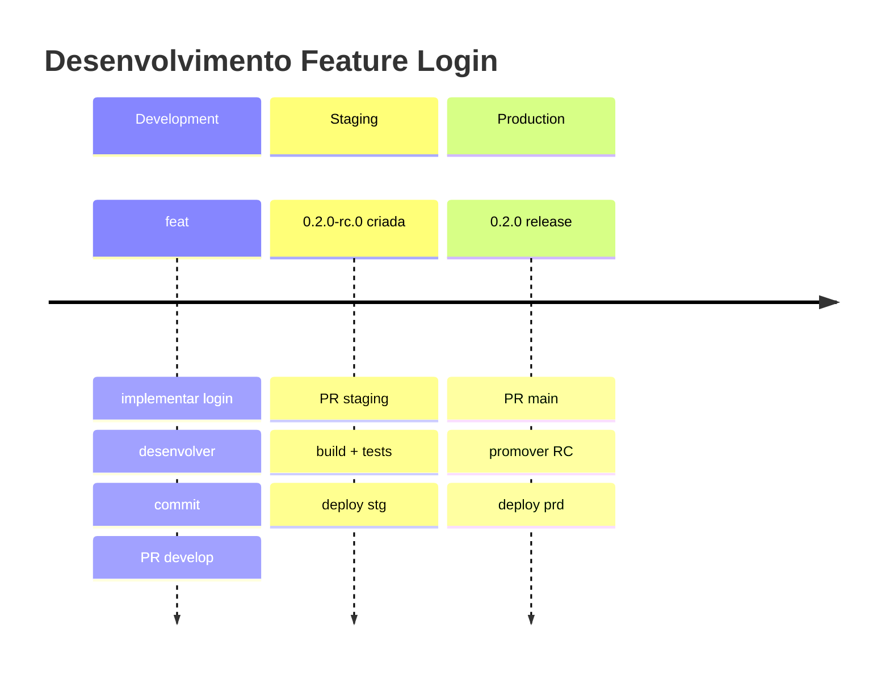
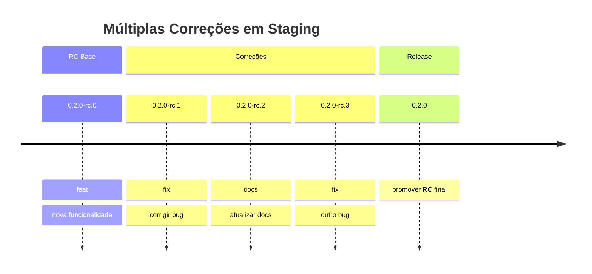
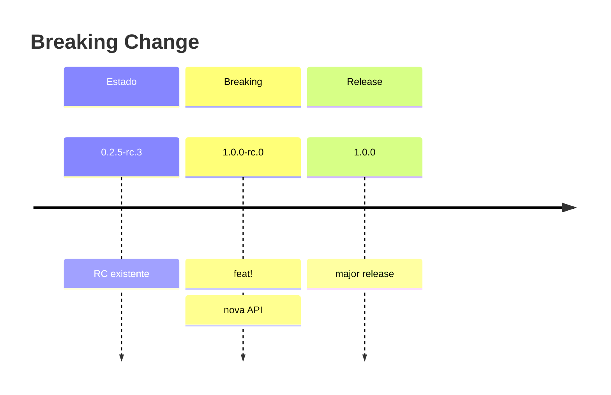

<!-- title: 03 - Versionamento Semântico | url: https://outline.seazone.com.br/doc/03-versionamento-semantico-WDrZZwIZ5N | area: Tecnologia -->

# 03 - Versionamento Semântico

## 📋 Visão Geral

O **Semantic Versioning V2** da Seazone é um sistema automatizado que gera versões baseadas nos títulos dos PRs seguindo o padrão [Semantic Versioning 2.0.0](https://semver.org/). É inteligente, robusto e foi projetado para eliminar erros manuais.

## 🎯 Entendendo Semantic Versioning

### Formato: X.Y.Z

```
1.2.3
│ │ └── PATCH: Bug fixes, mudanças internas
│ └──── MINOR: Novas funcionalidades compatíveis
└────── MAJOR: Breaking changes, incompatibilidades
```

### Exemplos Práticos

* `0.1.0 → 0.2.0`: Nova funcionalidade (minor)
* `0.2.0 → 0.2.1`: Bug fix (patch)
* `0.2.1 → 1.0.0`: Breaking change (major)

 

## 📊 Conventional Commits

### Tipos Suportados

| Tipo | Incremento | Versionamento | Exemplo |
|----|----|----|----|
| `feat:` | **MINOR** | `0.1.0` → `0.2.0` | `feat: adicionar sistema de login` |
| `fix:` | **PATCH** | `0.2.0` → `0.2.1` | `fix: corrigir erro de validação` |
| `feat!:` | **MAJOR** | `0.2.1` → `1.0.0` | `feat!: alterar estrutura da API` |
| `fix!:` | **MAJOR** | `0.2.1` → `1.0.0` | `fix!: remover endpoint deprecated` |
| `docs:` | **PATCH** | `0.2.0` → `0.2.1` | `docs: atualizar README` |
| `style:` | **PATCH** | `0.2.0` → `0.2.1` | `style: corrigir formatação` |
| `refactor:` | **PATCH** | `0.2.0` → `0.2.1` | `refactor: melhorar performance` |
| `test:` | **PATCH** | `0.2.0` → `0.2.1` | `test: adicionar testes unitários` |
| `chore:` | **PATCH** | `0.2.0` → `0.2.1` | `chore: atualizar dependências` |
| `perf:` | **PATCH** | `0.2.0` → `0.2.1` | `perf: otimizar consultas SQL` |
| `ci:` | **PATCH** | `0.2.0` → `0.2.1` | `ci: melhorar pipeline` |
| `build:` | **PATCH** | `0.2.0` → `0.2.1` | `build: atualizar Docker` |

## 🎯 Versionamento por Branch

### Comportamento por Branch

| Branch | Análise Título | Tag Gerada | Release Type | Exemplo |
|----|----|----|----|----|
| **develop** | ❌ Ignorado | `dev-{sha}` | Dev Version | `dev-a1b2c3d` |
| **staging** | ✅ Analisado | `X.Y.Z-rc.N` | Release Candidate | `0.2.0-rc.1` |
| **main** | ❌ Ignorado | `X.Y.Z` | Release Final | `0.2.0` |
| **hotfix/**\* | ✅ Analisado | `X.Y.Z-hf.N` | Hotfix | `0.2.1-hf.0` |

### Por que ignorar títulos em algumas branches?

#### Develop

* **Foco**: Desenvolvimento rápido
* **Objetivo**: Identificação, não versionamento semântico
* **Benefício**: Menos overhead para desenvolvedores

#### Main

* **Foco**: Workflow otimizado
* **Objetivo**: Sempre promover RC existente
* **Benefício**: Sem erros de versionamento manual

 

## 🤖 RC Numbering Inteligente

### O que é RC?

**Release Candidate (RC)** é uma versão candidata a se tornar release final. Exemplo: `0.2.0-rc.1`

### Como funciona?

O sistema decide quando **incrementar a base** vs **incrementar apenas o RC number**:

#### Cenário 1: Nova Base (Incrementa X.Y.Z)

```bash

Estado atual: 0.1.1 (última release)
PR: feat: implementar notificações

Análise: feat = minor increment

Resultado: 0.2.0-rc.0  # Nova base minor
```

#### Cenário 2: RC Existente (Incrementa apenas RC number)

```bash

Estado atual: 0.2.0-rc.0 (já existe RC com base 0.2.0)
PR: fix: corrigir erro de validação  
Análise: fix = patch, mas RC já tem minor (0.2.0)
Resultado: 0.2.0-rc.1  # Incrementa apenas RC number
```

#### Cenário 3: Breaking Change (Sempre nova base)

```bash

Estado atual: 0.2.0-rc.5

PR: feat!: alterar estrutura da API

Análise: feat! = major (sempre cria nova base)
Resultado: 1.0.0-rc.0  # Nova base major
```

### Tabela de Decisão RC

| Estado Atual | Nova Mudança | Resultado | Explicação |
|----|----|----|----|
| `0.1.1` (release) | `feat:` | `0.2.0-rc.0` | Nova base minor |
| `0.2.0-rc.0` | `fix:` | `0.2.0-rc.1` | RC já tem minor ≥ patch |
| `0.2.0-rc.1` | `feat:` | `0.2.0-rc.2` | RC já tem minor ≥ minor |
| `0.2.0-rc.2` | `feat!:` | `1.0.0-rc.0` | Breaking = sempre nova base |
| `0.2.1-rc.0` | `feat:` | `0.3.0-rc.0` | Nova base minor > RC base |

## 📋 Cenários Completos

### Cenário A: Fluxo Normal com Single RC



**Timeline**:


1. `develop`: `feat: implementar sistema de login` → `dev-a1b2c3d`
2. `staging`: `feat: implementar sistema de login` → `0.2.0-rc.0`
3. `main`: `release: login v0.2.0` → `0.2.0` (promove RC)
4. \

### Cenário B: Fluxo com Múltiplas RCs



**Timeline**:


1. `staging`: `feat: nova funcionalidade` → `0.2.0-rc.0`
2. `staging`: `fix: corrigir bug` → `0.2.0-rc.1`
3. `staging`: `docs: atualizar documentação` → `0.2.0-rc.2`
4. `staging`: `fix: corrigir outro bug` → `0.2.0-rc.3`
5. `main`: `release: v0.2.0` → `0.2.0`

### Cenário C: Breaking Change



**Timeline**:


1. Estado: `0.2.5-rc.3` (RC existente)
2. `staging`: `feat!: refatorar API completa` → `1.0.0-rc.0` (nova base major)
3. `main`: `release: API v2.0` → `1.0.0`

## 🚨 Validações e Tratamento de Erros

### Validação 1: RC Obsoleta

#### Problema

```
Release atual: 0.3.0

RC encontrada: 0.2.0-rc.1

Tentativa: staging → main
```

#### Detecção

```bash

RC base (0.2.0) < Release atual (0.3.0)
Status: RC OBSOLETA
```

#### Erro Exibido

```
❌ ERRO: RC OBSOLETA DETECTADA

PROBLEMA:
- A RC 0.2.0-rc.1 tem base 0.2.0 menor que a release atual 0.3.0
- Esta RC foi criada antes da release 0.3.0 e não pode ser promovida

INVESTIGAÇÃO:
- Verifique se a release 0.3.0 foi criada manualmente
- Ou se houve um hotfix que passou direto para main

SOLUÇÃO:
- Crie uma nova RC no staging com base na release atual
- Ou delete a RC obsoleta e recrie a partir do estado atual
```

### Validação 2: Sem RC Encontrada

#### Problema

```
Release atual: 0.2.0

RC encontrada: nenhuma

Tentativa: staging → main
```

#### Erro Exibido

```
❌ ERRO: NENHUMA RC ENCONTRADA

PROBLEMA:
- Tentativa de merge staging → main sem RC disponível
- Não há versão candidate para promover

SOLUÇÕES:
1. Crie uma RC no staging primeiro:
   - Faça um commit no staging
   - Aguarde a RC ser gerada automaticamente

2. Ou use hotfix se for correção urgente:
   - Crie branch hotfix/nome-do-fix
   - Commit direto será promovido automaticamente
```

### Validação 3: Release Já Existe

#### Problema

```
Release atual: 0.2.0

RC encontrada: 0.2.0-rc.1

Tentativa: staging → main
```

#### Resultado (Não é erro)

```
⚠️ RELEASE JÁ EXISTE

SITUAÇÃO:
- A RC 0.2.0-rc.1 já foi promovida para release 0.2.0
- Esta PR não resultará em nova release

AÇÃO:
- Workflow será pulado (sem erro)
- Nenhuma nova release será criada
```

## 🔧 Exemplos Práticos de Títulos

### ✅ Títulos Corretos

#### Features

```bash

feat: implementar sistema de autenticação OAuth

feat: adicionar filtros avançados na busca

feat: integrar com API de pagamentos

feat!: refatorar modelo de dados do usuário
```

#### Bug Fixes

```bash

fix: corrigir erro de timeout na API

fix: resolver problema de memory leak

fix: ajustar validação de email

fix!: remover endpoint deprecated /old-api
```

#### Documentação

```bash

docs: adicionar guia de instalação

docs: atualizar API documentation

docs: corrigir exemplos no README
```

#### Manutenção

```bash

chore: atualizar dependências do projeto

chore: configurar pre-commit hooks

style: ajustar formatação do código

refactor: melhorar performance da consulta

test: adicionar testes para módulo de pagamento

ci: otimizar pipeline de build
```

### ❌ Títulos Incorretos

```bash
# Muito genérico
"fix bug"
"update code"  
"work in progress"

# Sem tipo
"implementar login"
"corrigir erro"
"atualizar documentacao"

# Muito longo
"feat: implementar sistema completo de autenticação com OAuth2, JWT, refresh tokens, rate limiting, e integração com banco de dados PostgreSQL"

# Tipo errado
"feature: adicionar login"  # use "feat:"
"bugfix: corrigir erro"     # use "fix:"
```

 

## 📊 Dashboard de Versionamento

### Informações que o Sistema Fornece

#### Durante o Workflow

```bash
# Logs importantes para debug
"MINOR: mantendo base 0.2.0, incrementando RC: 0.2.0-rc.1 → 0.2.0-rc.2"
"Promovendo RC para release final: 0.2.0-rc.4 → 0.2.0"
"RC vs Release: patch" 
"deve_incrementar_base_rc retornou: false"
"Release 0.2.0 criada com sucesso"
"Tag Path: /apps/reservas-api/0.2.0"
```

#### No GitHub Release

```markdown
## Release 0.2.0-rc.1

### Changes
- Nova funcionalidade de notificações
- Correção de bug no sistema de login
- Melhorias de performance

### Type: Release Candidate
### Base Version: 0.2.0
### RC Number: 1
```

#### No Slack (#app-pipeline) - (**⚠️ ainda será implementado**)

```
✅ Release 0.2.0-rc.1 criada com sucesso!

Environment: staging

Type: Release Candidate  
Previous: 0.2.0-rc.0

Author: @johnpaulo0602

PR: #42 - feat: implementar notificações

Tag Path: /apps/reservas-api/0.2.0-rc.1

🔗 https://github.com/repo/releases/tag/0.2.0-rc.1
```

## 🔍 Troubleshooting

### "Minha versão não foi gerada corretamente"


1. **Verifique o título do PR**:

   ```bash
   # Correto
   feat: adicionar sistema de login
   
   # Incorreto  
   adicionar login
   ```
2. **Verifique os logs do workflow**:
   * GitHub Actions → Workflow → Step "Analisar tipo de mudança"
3. **Verifique se é a branch correta**:
   * `develop` → sempre `dev-{hash}`
   * `staging` → sempre `X.Y.Z-rc.N`
   * `main` → sempre `X.Y.Z`

### "RC não foi promovida corretamente"


1. **Verificar se RC existe**:

   ```bash
   git tag -l "*rc*" | sort -V
   ```
2. **Verificar logs do script**:
   * Procurar por "[promover-release-final.sh](http://promover-release-final.sh)" logs
3. **Verificar validações**:
   * RC obsoleta?
   * Release já existe?