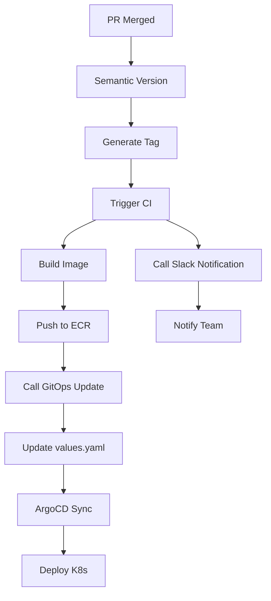
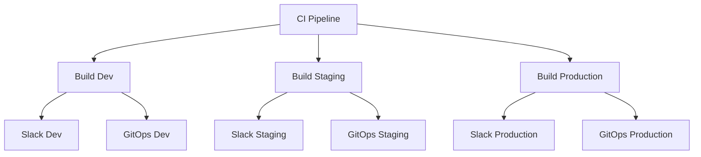

<!-- title: 04 - Workflows e Pipelines | url: https://outline.seazone.com.br/doc/04-workflows-e-pipelines-AxAJe6ld6w | area: Tecnologia -->

# 04 - Workflows e Pipelines


## 📋 Visão Geral

Esta seção detalha todos os workflows automatizados da Seazone, desde o momento que você faz commit até o deploy em produção. Entender esses pipelines é essencial para debugar problemas e acompanhar seus deployments.

 

## 🏗️ Arquitetura de Workflows

### Tipos de Workflows

| Workflow | Repositório | Trigger | Função |
|----|----|----|----|
| **Semantic Version** | App Repo | PR merged | Gerar versões semânticas |
| **CI Pipeline** | App Repo | Called by Semantic Version | Build, test, deploy |
| **GitOps Update** | Governança | Called by CI | Atualizar manifestos |
| **Slack Notification** | Governança | Called by CI | Notificar equipe |
| **PR Title Validator** | App Repo | PR opened | Validar títulos |

### Fluxo de Execução



 

## 📦 Workflow 1: Semantic Version

### Localização

* **Arquivo**: `.github/workflows/semantic-version.yaml`
* **Repositório**: App repo (ex: `reservas-api-sa-east-1`)

### Triggers

```yaml

on:
  pull_request:
    types: [closed]
    branches: [develop, staging, main, "hotfix/*"]
  push:
    branches: ["hotfix/*"]
  workflow_dispatch:
```

### O que faz


1. **Calcula nova versão** baseada no tipo do título do PR
2. **Cria GitHub Release** com changelog
3. **Dispara CI Pipeline** via repository_dispatch

### Run Names Inteligentes

```yaml
# Desenvolvimento
"Generate dev version (feature/login → develop) | for @johnpaulo0602"

# Staging
"Generate pre-release (develop → staging) | for @johnpaulo0602"

# Production  
"Generate release (staging → main) | for @johnpaulo0602"

# Hotfix
"Generate pre-release (hotfix) | for @johnpaulo0602"
```

### Inputs

```yaml

inputs:
  branch: ${{ github.event.pull_request.base.ref }}
  token: ${{ secrets.GITHUB_TOKEN }}
  repo-owner: ${{ github.repository_owner }}
  pr-title: ${{ github.event.pull_request.title }}
```

### Outputs

```yaml

outputs:
  version: "0.2.0-rc.1"
  is_prerelease: "true"  
  version_anterior: "0.1.1"
  tipo_incremento: "Minor (feature)"
```

 

## 🏗️ Workflow 2: CI Pipeline

### Localização

* **Arquivo**: `.github/workflows/ci.yaml`
* **Repositório**: App repo

### Triggers

```yaml

on:
  repository_dispatch:
    types: [semantic-version-completed]
  workflow_dispatch:
    inputs:
      environment:
        type: choice
        options: [dev, stg, prd]
      tag:
        type: string
```

### Jobs Structure



### Job: Build (Universal)

#### Ambiente Determination

```yaml
# Lógica de ambiente baseada no payload ou input

environment: ${{ 
  github.event.client_payload.environment || 
  (contains(github.event.client_payload.version, 'dev-') && 'dev') ||
  (contains(github.event.client_payload.version, 'rc') && 'stg') ||
  'prd'
}}
```

#### Steps Principais


1. **Checkout code** com fetch-depth: 0
2. **Configure AWS credentials** via OIDC
3. **Login to ECR**
4. **Build Docker image**
5. **Run security scan** (Trivy)
6. **Run tests** (se aplicável)
7. **Push to ECR** com múltiplas tags
8. **Call GitOps update**
9. **Call Slack notification**

 

## 🔄 Workflow 3: GitOps Update

### Localização

* **Arquivo**: `gitops-governanca/.github/workflows/app-ci-gitops-update.yaml`
* **Repositório**: `gitops-governanca`

### Como é Chamado

```yaml
# Do CI Pipeline
- name: Update GitOps Repository
  uses: seazone-tech/gitops-governanca/.github/workflows/app-ci-gitops-update.yaml@main
  with:
    gitops_repo: "gitops-reservas"
    app_name: "reservas-api"
    version: ${{ github.event.client_payload.version }}
    values_path: "helm/api/values-${{ steps.determine-env.outputs.environment }}.yaml"
    tag_path: "app.image.tag"
  secrets:
    GH_TOKEN: ${{ secrets.GH_TOKEN }}
```

### Inputs

```yaml

inputs:
  gitops_repo:          # "gitops-reservas"
    required: true
  app_name:             # "reservas-api"  
    required: true
  version:              # "0.2.0-rc.1"
    required: true
  values_path:          # "helm/api/values-stg.yaml"
    required: true
  tag_path:             # "app.image.tag"
    required: true
    default: "app.image.tag"
```

### O que faz


1. **Clone GitOps repo** com token
2. **Backup arquivo** original
3. **Update YAML** usando yq
4. **Validate changes** com diff
5. **Commit changes** com mensagem padrão
6. **Push changes** para trigger ArgoCD

### Exemplo de Atualização

```yaml
# Antes (values-stg.yaml)
app:
  image:
    repository: "711387131913.dkr.ecr.sa-east-1.amazonaws.com/reservas-api"
    tag: "0.2.0-rc.0"
    pullPolicy: Always

# Depois  
app:
  image:
    repository: "711387131913.dkr.ecr.sa-east-1.amazonaws.com/reservas-api"
    tag: "0.2.0-rc.1"  # ← Atualizado
    pullPolicy: Always
```

### Commit Message

```bash

ci: update reservas-api to 0.2.0-rc.1 in stg environment

- App: reservas-api
- Version: 0.2.0-rc.1  
- Environment: stg
- File: helm/api/values-stg.yaml

Generated automatically by CI Pipeline
```

## 💬 Workflow 4: Slack Notification

### Localização

* **Arquivo**: `gitops-governanca/.github/workflows/app-ci-slack.yaml`
* **Repositório**: `gitops-governanca`

### Como é Chamado

```yaml
# Do CI Pipeline
- name: Send Slack Notification
  uses: seazone-tech/gitops-governanca/.github/workflows/app-ci-slack.yaml@main
  with:
    app_name: "reservas-api"
    tag: ${{ github.event.client_payload.version }}
    environment: ${{ steps.determine-env.outputs.environment }}
    status: "success"
    workflow_url: ${{ github.server_url }}/${{ github.repository }}/actions/runs/${{ github.run_id }}
  secrets:
    SLACK_BOT_TOKEN: ${{ secrets.SLACK_BOT_TOKEN }}
```

## 🔍 Workflow 5: PR Title Validator

### Localização

* **Arquivo**: `.github/workflows/pr-title-validator.yaml`
* **Repositório**: App repo

### Trigger

```yaml

on:
  pull_request:
    types: [opened, edited, synchronize]
```

### Action Utilizada

```yaml
- name: Validate PR title format  
  uses: amannn/action-semantic-pull-request@v5.5.3
  with:
    types: |
      feat
      fix
      docs
      style  
      refactor
      test
      chore
      perf
      ci
      build
      revert
    requireScope: false
    subjectPattern: ^[A-Z].+$
    wip: true
    validateSingleCommit: false
```

### Validações


1. **Type**: Deve ser um dos tipos permitidos
2. **Format**: `type: description`

### Exemplos de Validação

#### ✅ Válidos

```bash

feat: implementar sistema de login

fix: corrigir erro de timeout

docs: atualizar README

feat!: alterar estrutura da API

chore: atualizar dependências
```

#### ❌ Inválidos

```bash

feature: implementar login       # type errado

fix bug                          # formato errado  
feat: implementar login oauth    # sem maiúscula

implementar sistema de login     # sem type
```