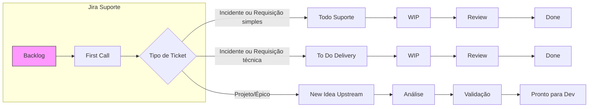

<!-- title: Organização de suportes | url: https://outline.seazone.com.br/doc/organizacao-de-suportes-siijrQia99 | area: Tecnologia -->

# Organização de suportes

---

## 1. Contexto & Objetivos

A equipe de Governança Tech (4 pessoas) atende desde requisições triviais (criação de conta, reset de senha) até demandas complexas de provisão de infraestrutura, IaC e onboarding de novas ferramentas (Argo CD, Argo Workflows, padronização de alertas).

### Desafio Principal

Evitar que chamados técnicos se acumulem no backlog e direcioná-los ao fluxo adequado: **Suporte Operacional**, **Delivery** ou **Upstream**.

### Objetivos da Estratégia

* Categorizar tickets por **Complexidade**, **Impacto** e **Tipo**
* Priorizar automaticamente via metadados (tags)
* Encaminhar adequadamente: suporte simples no board Suporte, demandas técnicas para Delivery, projetos para Upstream


---

## ⚙️ 2. Critérios de Classificação


---

### **Complexidade**

Nível de esforço técnico, recursos e variáveis envolvidos:

* **Baixa**: tarefas rotineiras, sem dependências externas, até 4 horas
  * *Exemplos: reset senha, criação usuário, consultas simples, ajustes de permissão*
* **Média**: ajustes que exigem validações ou aprovações, mais de 1 dia, pode envolver consulta a outras equipes
  * *Exemplos: configurações que precisam validação, troubleshooting com múltiplas variáveis*
* **Alta**: projetos ou integrações completas, mais de 3 dias, múltiplas etapas ou stakeholders
  * *Exemplos: implementação nova ferramenta, reestruturação de processos, integrações complexas*

### **Impacto**

Alcance e criticidade da solicitação:

* **Baixo**: afeta apenas o usuário solicitante ou função não crítica
* **Médio**: impacta parte da equipe, causa incômodo mas não bloqueia processos
* **Alto**: compromete sistemas críticos e/ou grande número de usuários

### **Tipo**

Natureza do chamado:

* **Incidente**: erro, falha ou interrupção de serviço em produção
* **Solicitação/Requisição**: pedidos de acesso, configurações, recursos
* **Projeto/Épico**: iniciativas de longa duração, padronizações, melhorias estruturais


## 🚩 3. Boards & Fluxos

### **Board Suporte Operacional**

* Atende tickets de **Complexidade Baixa** (Incidente ou Solicitação simples)
* Resolução rápida e fechamento no mesmo board
* **Score Cards fixos: 0.5** para todos os tickets de suporte

### **Board Delivery**

* Recebe tickets de **Complexidade Média** transferidos do Suporte
* Demandas técnicas que viraram tasks ou subtasks
* **Score Cards reavaliados** pelo responsável do Delivery conforme complexidade real

### **Board Upstream**

* Abriga **Projetos/Épicos** de Complexidade Alta
* Passa por validação e grooming antes de ir para Delivery

<https://www.mermaidchart.com/app/projects/378dd0e6-0a95-4346-904c-dfb4eff58272/diagrams/cb0f4925-b8a9-4770-87f1-1634cb5ed0fb/version/v0.1/edit>

 




---


## 🔄 4. Fluxo Operacional Completo

### **Entrada de Solicitações**

```javascript
Slack (botão) → Pipefy (formulário) → Make (automação) → Jira (BACKLOG)
```

### **Processo de Triagem**


1. **BACKLOG**: Todos os tickets chegam automaticamente aqui
2. **Seleção Manual**: Responsábel move tickets do Backlog para FIRST CALL
3. **FIRST CALL**:
   * Priorização do ticket
   * Contato via Slack com solicitante para obter informações adicionais, se for necessário
   * Decisão de destino

### **Direcionamento**

* **Suporte simples** → TODO (permanece no board Suporte)
* **Suporte complexo** → Transferido para board "Delivery" como task/épico
* **Projetos estruturais** → Board "Upstream" para análise estratégica

### **Fluxo Kanban - Board Suporte**

```javascript
BACKLOG → FIRST CALL → TODO → WIP → REVIEW → DONE
```

## 🏷️ 5. Sistema de Tags & Metadados

Para cada ticket de suporte, aplique as seguintes tags obrigatórias:

* `suporte`: identifica origem como chamado de suporte.
* `impacto:alto|medio|baixo`
* `tipo:incidente|requisicao|projeto`

Essas tags permitem filtros rápidos, relatórios e criação de painéis de monitoramento.


---

## 📊 6. Sistema de Esforço & Score Cards

### **Board Suporte**

* **Todos os tickets = 0.5 pontos** (obrigatório)
* Representa o esforço padrão do responsável por suporte
* Não há reavaliação de pontos no board de suporte

### **Transferência para Outros Boards**

* **Delivery**: Score Cards reavaliados pelo responsável
* Critério para transferência: complexidade excede capacidade de suporte simples

## ⏱️ 7. Acordos de Nível de Serviço (SLA)

### **Ver em [SLA de suportes](/doc/sla-de-suportes-OzqKn1PUl0)**

## ✅ 8. Definition of Done

Um ticket está **DONE** quando atende a **QUALQUER** critério abaixo:


1. ✅ **Feedback positivo** do solicitante (confirmação via Slack)
2. ✅ **Task visivelmente concluída** + sem necessidade de contato com solicitante
3. ✅ **Solicitante não retornou** em 2 dias úteis após nossa resposta final

### **Critérios de Qualidade**

* Solução efetiva do problema reportado
* Documentação adequada quando necessário
* Usuário capacitado para usar a solução (quando aplicável)

## 🔄 9. Processo de Escalação & Reclassificação

### **Durante o Atendimento**

* Se ticket "simples" vira complexo → mover para Delivery
* Se requer aprovações/validações → seguir chain de comando
* Se afeta múltiplos usuários → aumentar prioridade

### **Critérios para Transferência**

* **Para Delivery**: > maior esforço estimado, múltiplas dependências
* **Para Upstream**: requer mudança de processo, nova ferramenta, padronização


---

## 📊 10. Coleta de Feedback & Ajustes

* **Reunião trimestral para :** 
  * Analisar fluxo de suportes resolvidos 
  * coletar métricas de tipo, complexidade e impacto do suporte 
  * Reajustar processo se necessário 


---

## 🗺️ 11. Plano de Ação Passo a Passo


1. Treinar equipe sobre nova triagem e uso de tags.
2. Pilotar o processo por 2 semanas e coletar métricas iniciais.
3. Ajustar critérios e thresholds conforme resultados do piloto.
4. Documentar todo o fluxo e divulgar em manual interno.