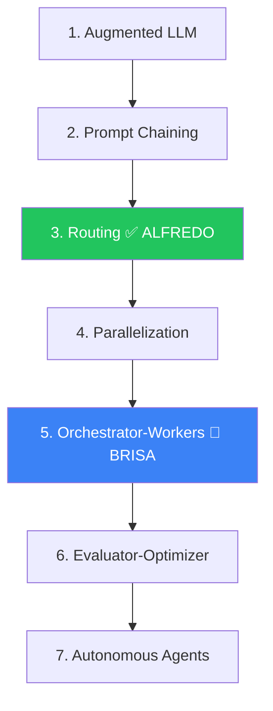
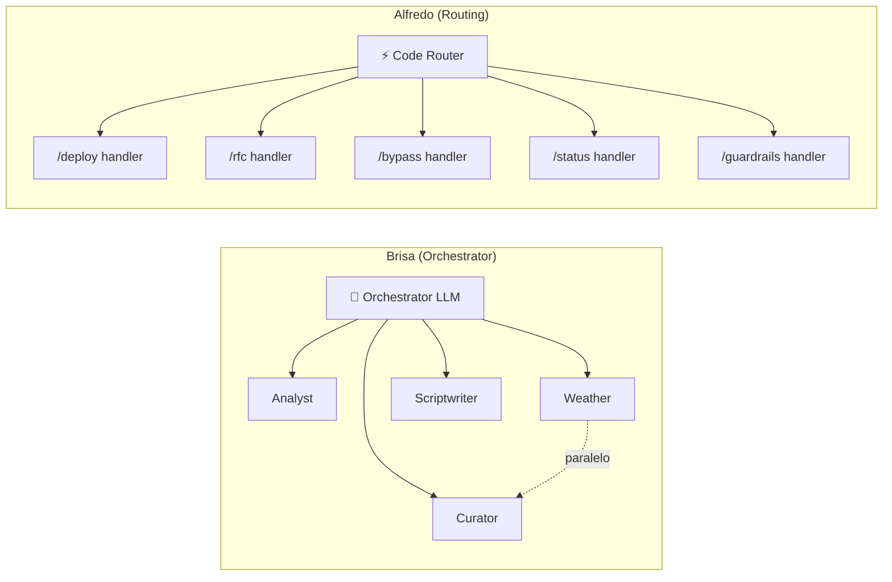

<!-- title: Single Agent vs Orchestrator — Análise Arquitetural | url: https://outline.seazone.com.br/doc/single-agent-vs-orchestrator-analise-arquitetural-33JfoKIFLS | area: Tecnologia -->

# Single Agent vs Orchestrator — Análise Arquitetural

# Single Agent vs Orchestrator — Análise Arquitetural

* **Status:** Concluída — decisão: Routing Pattern
* **Data:** 2026-04-10
* **Contexto:** Decisão sobre usar single agent com tools vs orchestrator multi-agent para o Alfredo


---

## Decisão

**Routing Pattern (single agent com prompts/tools focados por comando)**. Orchestrator multi-agent é over-engineering para o Alfredo v0. Arquitetura é forward-compatible para evoluir se necessário.

## Hierarquia de Padrões (Anthropic)



> *"Start with simple prompts, optimize them with comprehensive evaluation, and add multi-step agentic systems only when simpler solutions fall short."* — Anthropic

## Dados Empíricos

### Multi-agent amplifica erros

| Estudo | Achado |
|----|----|
| **Google DeepMind + MIT** (180 configs) | Multi-agent amplifica erros em até **17.2x** vs single-agent |
| **Estudo de produção** (arXiv 2503.13657) | 41-86.7% dos sistemas multi-agent falham. **79% por coordenação** |
| **Cognition (Devin)** | "Don't build multi-agents" — cria "telephone game" de contexto |
| **Custo** | 5 agentes = **25x complexidade de coordenação**, **2-5x tokens** |

### Tool calling — thresholds

| Quantidade | Recomendação |
|----|----|
| **<10 tools** | Funciona bem (Alfredo v0 tem \~8) |
| **10-30 tools** | Considerar tool search |
| **30-50 tools** | Acurácia degrada significativamente |

## Alfredo vs Brisa



| Característica | Brisa | Alfredo |
|----|----|----|
| **Routing** | LLM decide (incerto) | Slash command (determinístico) |
| **Paralelização** | Weather + Curator | Fluxos sequenciais |
| **Validação cruzada** | Orchestrator valida Curator | Não necessária |
| **Personalidades** | 4 vozes distintas | Uma voz (Alfredo) |
| **Latência** | OK esperar \~30s | Slack 3s timeout |

## Otimização Adotada

Do Brisa, adotamos **prompts e tools focados por comando**:

```
/alfredo deploy  → Deploy prompt (300 tokens) + 2 tools (createApp, searchKB)
/alfredo rfc     → RFC prompt (300 tokens) + 2 tools (createRFC, searchKB)
/alfredo bypass  → Bypass prompt (300 tokens) + 3 tools (getGuardrail, searchKB, recordAction)
/alfredo status  → Sem LLM — leitura pura do GitHub
/alfredo guardrails → Sem LLM — leitura pura do GitHub
```

## Escape Hatches

| Fase | Trigger | Evolução |
|----|----|----|
| **v1** | PR analysis precisa de checks paralelos | Adicionar Parallelization |
| **v2** | Comando com 15+ tools | Orchestrator-Workers para esse comando |

## Referências

* [Anthropic — Building Effective Agents](https://www.anthropic.com/research/building-effective-agents)
* [Google DeepMind/MIT — Scaling Agent Systems](https://research.google/blog/towards-a-science-of-scaling-agent-systems-when-and-why-agent-systems-work/)
* [Cognition — Don't Build Multi-Agents](https://cognition.ai/blog/dont-build-multi-agents)
* [arXiv — Multi-Agent Failure Study](https://arxiv.org/pdf/2503.13657)
* [Anthropic — Advanced Tool Use](https://www.anthropic.com/engineering/advanced-tool-use)
* [OpenAI Agents SDK](https://openai.github.io/openai-agents-python/multi_agent/)
* [Vercel AI SDK — Workflows](https://ai-sdk.dev/docs/agents/workflows)
* [hackathon-brisa](https://github.com/seazone-tech/hackathon-brisa) — Orchestrator de referência interna